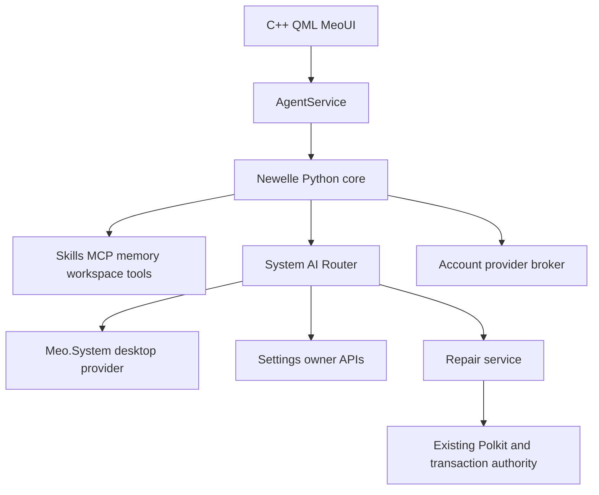

# Meo AI 架构与跨仓库实施计划

日期：2026-10-08。本文区分已经实现的第一阶段和后续目标。

## 决策

Fork `qwersyk/Newelle` 到 `QwQdoge/meo-ai`，继续保留 Python 引擎和
GPL-3.0；应用 UI 使用 C++、Qt Quick/QML 和 `MeoUI 1.0`。
不从 Nyarch 定制层起步。上游默认分支实际为 `master`，第一版实际版本为
1.5.2，不能把之前方案里的 1.5.0 当成当前源码版本。

初始上游基线：`b9f37f71e2bccaec4986c22897cfa43e4981741a`。
保留 `origin`（Meo fork）和 `upstream`（Newelle）两个 remote。

## 源码所有权与运行时边界

| 仓库 | 拥有的源码与职责 | Meo AI 如何使用 |
|---|---|---|
| meo-ai | Newelle 引擎、应用 UI、提示词、Skills；最终 Router 与 Repair 编排源码 | 独立用户进程；不以 root 运行 |
| meo-kde | Plasma/KWin 集成、Meo.System、桌面 capability provider | 通过维护的 Qt/KDE/D-Bus 接口 |
| MeoSettings | 设置页面与设置入口 | `org.meo.settings.openPage`；后续仅发布已实现的 typed API |
| MeoUI | 共享控件、tokens、motion | `import MeoUI 1.0`，应用专用卡片留在 meo-ai |
| meo-repo | PKGBUILD、依赖、发布输入、未来审核的 catalog | 原料来源和打包；不复制 agent 源码或提示词 |
| meoarch-os | ArchISO 配置、默认软件包、启动和安装验收 | 安装包；不保留第二份 AI 源码 |
| MeoArch-account | 身份、云连接、凭据、provider grant | 使用 broker，不能把凭据写入提示词或技能 |
| OmniStore / SystemTransaction | 软件包事务 / 窄化的特权配置事务 | 保留原服务和确认、Polkit、回滚边界 |

本地目录使用 `meoarch-os`。该 checkout 的现有 origin 名为
`QwQdoge/MeoArch-os-workspace`；不能因为远程显示名不同而恢复废弃的
下划线 checkout。

目标运行关系：

现在实现的传输为 **loopback HTTP v2 + SSE**。不是已完成的 headless
D-Bus AgentService：Newelle controller 仍导入 Adw/UIController，工具仍有
GTK 主线程依赖。新客户端先与可运行的 GTK 引擎并存；待 headless 抽取和
功能 parity 验收后再移除 GTK。

## 第一阶段实现

- `meo/app/`：原生 QML 聊天、新建会话、流式文本、工具决策按钮。
- 使用 Newelle `/v2/chat/completions`，历史由引擎保存。
- Qt 持久保存 `meo:<uuid>` 会话键，重启仍连接同一上游会话。
- 上游 SSE 保留文本，同时添加 `delta.meo_event`。结构化事件不自动批准工具。
- 使用 `/option N` 回复原有暂停队列。原有 API 暂停语义与工具循环复用。
- `meo:` 会话每一轮向 provider 的 system prompt 追加 Meo 分层规则；
  不把规则伪装成用户消息，也不因 mode 重建而丢失。
- `meo/skills/system-diagnostics/` 是可安装的示例，尚未自动启用或注册新能力。
- 原生客户端仅接受 loopback origin，拒绝重定向；可以传递显式 API key。

当前还没有取消操作。关闭客户端或网络断连不等于取消模型/工具执行。
不提供具有误导性语义的 Stop 按钮。下一个服务阶段需加入可验证的
request-local cancellation，取消暂停 ToolResult，同时保证不承诺撤销已
发生的外部操作。

现有终端、MCP、扩展功能继承自 Newelle，但其权限不是 OS containment。
提示词中的限制只是行为指导。本版不能宣传为已隔离的系统控制 agent。
原生客户端与上游 API 共用用户权限；随机会话键也不是认证凭据。

## Router 与 Repair 迁移顺序

当前 Router 真正源码是 `meo-kde/native/airouter/`，已注册：
`org.meo.application.launch`、`org.meo.desktop.audio.setVolume`、
`org.meo.desktop.audio.getVolume`、`org.meo.settings.openPage`。
其 `service.cpp` 仍直接链接 KIO/PulseAudioQt；不能只移动目录后称为已解耦。

1. 先合入/对齐能力元数据 PR #40 的最终版本，记录 owner、effect、verification、maturity。
2. 在 meo-kde 暴露稳定桌面 provider，把 KDE 的实际执行和读回放在 owner。
3. 使用保留历史的 extraction 分支把 Router core/服务源码迁入 meo-ai，
   维持 `org.meo.AIRouter1`、`/org/meo/AIRouter1` 和现有方法。
4. 一个 daemon 保持同一 session-bus connection，贯穿 Submit/Get/Decide。
   禁止每次以独立 `gdbus` 子进程调用导致 caller 变化。
5. meo-repo 改包来源并加 conflicts/provides，验证升级后只有一个 service owner。
6. Router 新包验收通过后，才移除 meo-kde 原 target/service。

Repair 当前在 `meoarch-os/repair/`。先记录来源 commit 和完整文件清单，
迁移 core/knowledge/UI/checks/tests，再更新包和 ISO 的来源。不得修改已有
`org.meo.Repair1`、Polkit action、root helper 的主体身份或把它们装入 agent
进程。检查和修复脚本属于原有审核的 service 实现；模型不能提供任意脚本。
迁移需保留 licensing、translations、live actions 和测试，而非只复制 UI。

## 分阶段验收

| 阶段 | 交付 | 必须通过的门槛 |
|---|---|---|
| A（本 PR） | fork、上游共存的 QML 客户端、prompt overlay、结构化 tool events | Python 协议测试、C++ transport 测试、QML 加载；真实 provider 另行验收 |
| B | Headless AgentService、历史/模型/skills/MCP/memory API、取消和错误状态 | Linux 独立进程，无 Gtk/Adw/WebKit import；启动、暂停、恢复、取消、崩溃恢复 |
| C | System tool + 桌面 owner API + Router extraction | caller binding、参数类型、未知能力、过期/拒绝、读回失败；真实 Plasma 验收 |
| D | Repair extraction、包来源更新、ISO 默认集成 | helper/Polkit 原有测试、单 service owner、staged install、Live/installed VM |
| E | workspace containment、extension/MCP 信任策略、调度/subagent UI | 独立 sandbox、资源/路径/网络边界、执行与读回，不依赖 prompt enforcement |
| F | UI parity、voice/live/image workflows，移除 GTK | 功能矩阵和迁移数据兼容验证全部通过 |

`meo-repo` 的 skill/catalog 应保存来源 commit、license、摘要和声明的
capabilities，不把声明当授权。模型 metadata 不能触发自动下载或云上传。
ISO integration 最后只装包/默认配置，D-Bus activation 和 user units 必须
有明确 package owner。冻结 release manifest 不因本开发分支自动更新。

## 本轮仓库证据

- meo-kde `origin/main`: `44ea500995ec10bb5780caa1aaf7e8a3f73450db`。
- MeoUI 本地基线: `fb27f21859144665dcc323e32fb4d6eb628536c0`。
- meoarch-os `origin/main`: `c0084daddb44f8314ba6704516d6bfd89196c756`。
- [Router metadata PR](https://github.com/QwQdoge/meo-kde/pull/40) 在检查时未合并。
- ISO 仓库已有 `refactor/meo-ai-repository-boundary` 的计划文件，已对齐其
  Account、Meo.System、SystemTransaction 所有权边界，没有覆盖它的分支。
