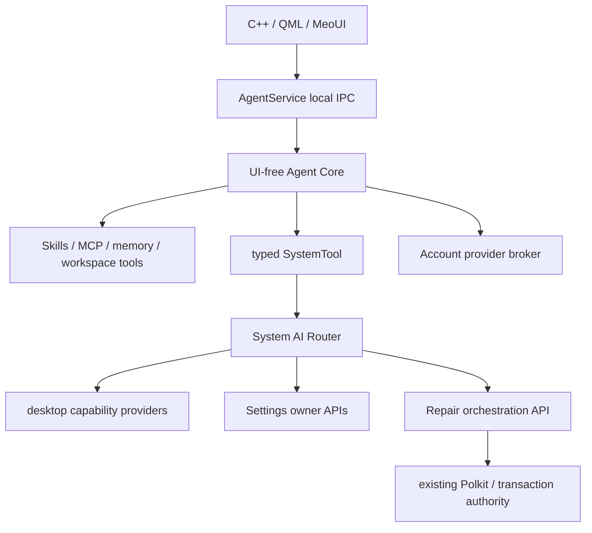

# Meo AI 架构与跨仓库实施计划

日期：2026-10-08。本文是当前架构 source of truth，必须区分“仓库已实现”“兼容过渡层”“需要目标机 live acceptance”和“后续阶段”。

## 决策

Fork `qwersyk/Newelle` 到 `QwQdoge/meo-ai`，保留 Newelle Python agent engine、上游历史和 GPL-3.0 义务；Meo 原生应用 UI 使用 C++、Qt Quick/QML 和 `MeoUI 1.0`。不从 Nyarch 的二次定制层起步。

初始 Newelle 基线：`b9f37f71e2bccaec4986c22897cfa43e4981741a`。产品特定代码优先放在 `meo/`；只有必要 integration seam 才修改 `src/`。

## 源码所有权与运行时边界

| 仓库 | 拥有的源码与职责 | Meo AI 如何使用 |
|---|---|---|
| `meo-ai` | Newelle-derived agent runtime、AgentService、原生 AI UI、prompts、Skills、SystemTool client；后续 Router core/Repair orchestration | 普通用户进程，不以 root 运行 |
| `meo-kde` | Plasma/KWin/桌面集成、当前 System AI Router daemon 与 KDE owner executors | typed D-Bus owner/provider API |
| `MeoSettings` | 日常系统设置和设置入口 | typed settings owner API；必要时 hand-off KCM |
| `MeoUI` | 共享 MD3 Expressive tokens、controls、motion、layout patterns | `import MeoUI 1.0`；AI 专用页面/卡片留在 `meo-ai` |
| `meo-repo` | PKGBUILD、source manifest、catalog metadata | 安装/升级来源，不复制 agent 源码 |
| `MeoArch-os-workspace` | ISO、默认软件包、系统集成、Live/installed VM 验收 | 最终安装和激活，不保存第二份 AI 源码 |
| `MeoArch-account` | 身份、provider credentials/grants | 后续 broker；凭据不能进入 prompts/Skills |
| OmniStore / SystemTransaction / Repair | 软件事务、窄化特权配置、修复 authority | 保留 Polkit/确认/回滚边界 |

核心原则：**MeoUI ≠ AI，Settings ≠ AI，meo-kde ≠ AI，AI ≠ system implementation。**

## 目标运行关系



这个图是目标架构。当前仍有两个过渡层：

1. AgentService 的 Newelle backend 仍通过兼容 adapter 包装 GTK-era `src.controller`；用 import shim 避免构造 UI，但还没有完成真正 UI-free `AgentCore` 抽取。
2. AgentService 的当前 transport 是 hardened loopback HTTP/SSE。它适合开发和语义验证，但**不是最终 system authorization boundary**。最终本地 IPC/activation 仍需和发行版集成一起确定。

## 当前已实现：原生 UI

`meo/app/` 已经不是最早的测试聊天框，而是 MeoUI 原生桌面界面：

- adaptive sidebar / compact layout；
- Meo AI branding 与 runtime status；
- user/assistant message bubbles；
- welcome / quick-start content；
- tool confirmation card；
- fixed composer、Send、Stop、New chat；
- 全部使用 MeoUI/MeoTheme tokens，而不是另造一套主题。

当前 UI 不伪造尚未完成的 History/Skills/Settings 页面。只有已有 contract 的内容才进入正式交互。

## 当前已实现：AgentService Phase B foundation

### Service ownership

`AgentServiceCore` 已拥有：

- service-generated `request_id`；
- service-generated `decision_id`；
- request lifecycle；
- stale/replay/cross-request decision rejection；
- backend execution-handle ownership；
- early callback buffering；
- explicit cancellation；
- event journal / reconnect cursor；
- conversation identity；
- presentation-safe history；
- models / Skills / MCP metadata；
- minimal service-owned AgentState。

生命周期：

```text
queued
  -> running_model
  -> awaiting_tool
  -> running_tool
  -> running_model ...
  -> completed

任何非 terminal 状态
  -> cancel_requested
  -> cancelled / failed
```

SSE disconnect 只是 transport loss，不等于取消。

### Tool handling

兼容层现在同时处理：

- interactive `tool_interaction` -> `tool.requested`；
- ordinary `tool_result` -> `tool.completed`。

普通工具完成后不会因为 bridge 只认识 confirmation event 而把整个 request 误报失败。

等待 interactive `ToolResult` 时 Stop 会主动取消 pending ToolResult、释放 semaphore，再停止 request-local model work；不会只改 service state 而让 worker 永久卡住。

Cancellation 仍然**不是 rollback**。已经提交给外部 owner 的操作不能因为 agent workflow 被取消就声称已撤销。

### Conversation persistence

Meo-owned inherited chats 带 `meo_conversation_id` metadata。重复 metadata 会被视为 ambiguous，adapter 不猜 ownership。

AgentService 提供 presentation-safe history：只暴露 `user` / `assistant` 文本。不会把 `Console`、`Command`、`File`、`Folder`、tool internals 或 prompt-only `<context>` retrieval data 重放进 QML。

Native client 保存当前 AgentService conversation id。重新打开应用时会请求 history 并恢复消息；如果旧 conversation 已不存在，404 会清除 stale identity，下一次发送再创建新会话。

### Catalog APIs

Models 来自 Newelle provider handlers 的 structured model list。当前 Newelle model selection 是 profile scoped，因此 UI 不能暗示只影响一个 conversation。

Skills 来自 `SkillManager`：

- `configured_enabled` = 用户持久 profile preference；
- `enabled` = 当前 Mode/runtime overlay 后的 effective state；
- `override_source=mode` 时 UI 可解释两者差异。

MCP metadata 来自 Newelle `mcp_servers` / `mcp_servers_dict`。AgentService 只暴露 non-secret id、display label 和当前 integration 是否加载；不会把 raw URL、bearer token、custom headers、stdio env 等配置送到前端。

### Current HTTP mapping

当前 loopback preview transport 包括：

- `GET /v1/agent-state`
- `GET /v1/conversations`
- `POST /v1/conversations`
- `GET /v1/conversations/{id}/messages`
- `POST /v1/conversations/{id}/messages`
- `GET /v1/requests/{id}`
- `GET /v1/requests/{id}/events?after=N`
- `POST /v1/requests/{id}/cancel`
- `POST /v1/requests/{id}/decisions/{decisionId}`
- model / Skill / MCP catalog endpoints。

它只允许 loopback bind、检查 loopback Host、拒绝 browser `Origin` / CORS preflight、要求 JSON POST，并拒绝 redirect-following native client assumptions。但这些 hardening **不等于认证**。

### Installed service

仓库会 staged-install：

- `meo-agent-service` launcher；
- unprivileged systemd user unit；
- AgentService runtime / adapter / system modules。

当前 unit 不由本仓库自动 enable。Native client 仍通过显式 AgentService endpoint 进入 service mode；在发行版有可靠 activation 前，不把 legacy path 静默删除。

## 当前已实现：early Phase C SystemTool preview

System control默认关闭。只有显式 `MEO_AI_ENABLE_SYSTEM_TOOL=1` 才安装 Newelle compatibility system tools。

`SystemTool`：

- 只调用 Router typed `SubmitRequest`，不调用自然语言 `SubmitText`；
- 自己不执行 KIO/PulseAudioQt/KWin/Polkit/Repair 操作；
- 使用 persistent `dbus-next` session-bus connection，保证 Submit/Get/Decide 是同一个 D-Bus caller identity；
- 不使用每次新 caller 的 `gdbus`/`busctl` subprocess；
- 从 Router `ListCapabilities()` 获取 capability metadata 和 authoritative `argumentSchema`；
- 每个 capability 映射成一个固定 Newelle Tool，而不是给模型一个自由填写 capability id 的万能工具；
- Router `awaiting_confirmation` 映射为明确 Deny/Approve；不自动批准；
- confirmation display 传递 Router title/target/impact，但展示文本不构成 authority。

`meo-kde` PR #40 已经合入 main；owner/effect/verification/maturity metadata 已是当前基线。Router main 也已经发布 `argumentSchema`，并有 native schema contract tests。

## Router 与 Repair 仍未迁移

**不要因为 SystemTool client 已存在就称 Phase C 完成。**

Router daemon/core 当前仍位于 `meo-kde/native/airouter/`，而且 executor 仍直接链接 KIO/PulseAudioQt。正确迁移顺序仍然是：

1. 保持现有 D-Bus ABI：`org.meo.AIRouter1` / `/org/meo/AIRouter1`；
2. 让 `meo-kde` 暴露稳定 desktop provider API，把 KDE execution/read-back 留在 owner；
3. 再把 Router core/policy/registry/request lifecycle 抽到 `meo-ai`；
4. 保持 caller binding、fingerprint、expiry、confirmation 和 verification semantics；
5. 更新 `meo-repo` package ownership / conflicts / provides；
6. 证明升级后只有一个 Router service owner；
7. 最后移除旧 meo-kde Router target/service。

Repair 仍在原 authority 边界。不得把 root helper、Polkit action 或任意 model-generated privileged script 搬进 agent process。Repair extraction 必须保留原 service identity、knowledge/checks/tests/licensing、transaction/rollback 语义，并经过 Live/installed VM 验收。

## 尚未完成 / 不得过度声称

Phase B 仍有这些真实缺口：

- 真正 UI-free Newelle `AgentCore` 尚未从 GTK-era controller 抽出；
- 当前 headless backend 仍是 compatibility shim；
- real provider/local model headless inference 尚需目标机验收；
- real model wait / real long-running tool cancellation 尚需 live acceptance；
- memory API 尚未定义为稳定 frontend contract；
- systemd user-session activation/restart、关闭 frontend 后 service survival 尚需目标机验收；
- AgentService 尚未成为发行版默认 IPC path；
- 最终 local IPC/authentication boundary 未定；loopback HTTP 不能当 system authorization；
- MeoArch package / ISO 默认安装与 activation 尚未完成；
- Account credential broker 尚未接入。

Phase C 仍有这些缺口：

- desktop provider 与 Router core 尚未分离；
- Router core 尚未 extraction 到 `meo-ai`；
- 真实 Plasma SystemTool calls 和 owner read-back 尚需 live acceptance；
- capability schema 以后还可增加 range/enum/pattern 提示，但 Router runtime validation 永远是 authority。

## 分阶段验收

| 阶段 | 当前状态 | 必须通过的门槛 |
|---|---|---|
| A | 基本完成 | fork、native QML、prompt overlay、structured tool event、CI |
| B | repo-side foundation 接近完成，live 未完成 | UI-free runtime、history/models/Skills/MCP/memory/state、真实 provider、pause/resume/cancel/crash/restart |
| C | typed SystemTool preview 已有，Router extraction 未做 | caller binding、schema、confirmation、verification、desktop provider split、real Plasma |
| D | 未开始正式迁移 | Repair extraction、single authority、Polkit/helper tests、package/ISO/VM |
| E | 未开始 | workspace containment、extension/MCP trust、resource/path/network sandbox |
| F | 未完成 | full UI parity、voice/live/image workflows、GTK removal、migration compatibility |

## 下一步顺序

1. 保持 PR #2 为单一 integration PR，不再为了阶段拆多个 PR。
2. 先让 history restore、MCP metadata、AgentState 和 native tests 持续 green。
3. 做目标机 Phase B live acceptance，特别是真实 provider、cancel、service restart/survival。
4. 设计可靠 installed-service activation / final local IPC boundary，再把 native client 默认切到 AgentService；legacy `/v2` 变成兼容 fallback。
5. 再开始 desktop provider split / Router extraction。
6. Router migration 完成后才推进 Repair extraction。
7. 最后接 `meo-repo`、ISO、Account broker 和完整 UI parity。

任何阶段都不能用 prompt/Skill/MCP 声明替代 typed capability policy，也不能把“CI mock 通过”描述成“真实 MeoArch/Plasma 已验收”。
